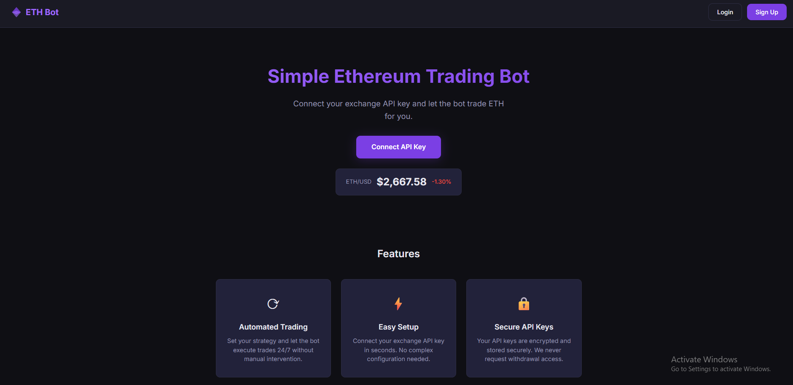

# ETH Trading Bot

A simple Ethereum trading bot web app built with the MERN stack.



## Features

- Dark theme UI with ETH purple accent
- User authentication (JWT)
- Connect exchange API keys (encrypted storage)
- Live ETH/USD price display
- Exchange connection status check via ccxt

## Project Structure

```
/client   → React frontend (Vite)
/server   → Express backend (JavaScript)
```

## Setup

### 1. Install dependencies

```bash
npm run install:all
```

### 2. Configure environment

Copy the example env file and fill in your values:

```bash
cp server/.env.example server/.env
```

Required variables:
- `MONGO_URI` – MongoDB connection string
- `JWT_SECRET` – secret for signing JWT tokens
- `ENCRYPTION_KEY` – key for encrypting API secrets

### 3. Run the app

```bash
npm run dev
```

- Frontend: http://localhost:3000
- Backend: http://localhost:5000

## API Endpoints

| Method | Endpoint | Description |
|--------|----------|-------------|
| POST | /api/auth/register | Create a new account |
| POST | /api/auth/login | Login and get JWT token |
| POST | /api/keys | Save exchange API key |
| GET | /api/keys/status | Check API key connection |
| GET | /api/price | Get current ETH/USD price |

## Disclaimer

Crypto trading involves risk. This is not financial advice. Trade responsibly.
